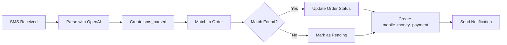

# SMS Mobile Money Payment Processing

This feature enables automatic detection and processing of mobile money payment notifications via SMS on Android devices.

## Overview

The SMS payment processing system allows the app to:
1. Read mobile money payment SMS messages (with user permission)
2. Parse payment details using OpenAI API
3. Store parsed data in Supabase
4. Automatically match and allocate payments to pending orders
5. Approve and confirm transactions without requiring external payment API integration

## Architecture

### Components

1. **Mobile Layer (Android)**
   - `SmsReaderPlugin.java`: Native Android plugin for reading SMS
   - `sms-reader.ts`: TypeScript wrapper and React hooks
   - Requests `READ_SMS` permission from user

2. **Frontend Layer**
   - `SmsPermissionCard`: Component for requesting SMS permissions
   - `MobileMoneyPaymentHistory`: Component for displaying payment history
   - `/payments` page: Combined interface for SMS settings and payment tracking

3. **Backend API Layer**
   - `POST /api/sms/process`: Receives SMS from mobile, stores in database
   - `GET /api/payments/mobile-money`: Retrieves user's payment history
   - `POST /api/payments/mobile-money`: Manual payment entry

4. **Edge Functions (Supabase)**
   - `parse-sms`: Uses OpenAI to extract payment details from SMS text
   - `match-payment`: Matches payments to pending orders and allocates them
   - `sms-webhook`: External webhook for SMS forwarding services

5. **Database Layer**
   - `sms_raw`: Stores raw SMS messages
   - `sms_parsed`: Stores OpenAI-parsed payment data
   - `mobile_money_payments`: Tracks payment allocation status

## Database Schema

### sms_raw
- `id`: UUID primary key
- `user_id`: Reference to auth.users
- `phone_number`: Sender phone number
- `text`: Raw SMS content
- `received_at`: When SMS was received
- `processed`: Whether SMS has been parsed

### sms_parsed
- `id`: UUID primary key
- `sms_id`: Reference to sms_raw
- `amount`: Payment amount (integer, RWF)
- `currency`: Currency code (default: RWF)
- `payer_mask`: Masked payer phone number
- `ref`: Transaction reference
- `confidence`: AI parse confidence (0-1)

### mobile_money_payments
- `id`: UUID primary key
- `sms_parsed_id`: Reference to sms_parsed
- `user_id`: Reference to auth.users
- `amount`: Payment amount
- `ref`: Transaction reference
- `status`: 'pending' | 'allocated' | 'failed' | 'manual'
- `allocated_to`: Type of allocation (ticket_order, shop_order, etc.)
- `allocated_id`: ID of allocated record
- `allocated_at`: When allocation occurred

## Setup Instructions

### Prerequisites

1. **OpenAI API Key**: Required for SMS parsing
   ```bash
   OPENAI_API_KEY=sk-...
   ```

2. **Supabase Configuration**: Service role key for edge functions
   ```bash
   SUPABASE_SERVICE_ROLE_KEY=...
   NEXT_PUBLIC_SUPABASE_URL=...
   ```

### Database Migration

Run the migration to create required tables:

```bash
# Local development
supabase migration up --local

# Production
supabase migration up --remote
```

### Android Setup

1. **Register Native Plugin**

Edit `android/app/src/main/java/com/rayonsports/fanapp/MainActivity.java`:

```java
import com.rayonsports.fanapp.plugins.SmsReaderPlugin;

public class MainActivity extends BridgeActivity {
  @Override
  public void onCreate(Bundle savedInstanceState) {
    super.onCreate(savedInstanceState);
    
    // Register plugins
    registerPlugin(SmsReaderPlugin.class);
  }
}
```

2. **Build Android App**

```bash
npm run cap:sync
npm run cap:android
```

3. **Test Permissions**

The app will request SMS permission when the user navigates to the Payments page and clicks "Grant SMS Permission".

## Usage Flow

### For Users

1. Navigate to **Payments** page in the app
2. Go to **SMS Settings** tab
3. Click **Grant SMS Permission**
4. Allow SMS permission in Android dialog
5. Create a pending order (ticket, shop item, etc.)
6. Make mobile money payment via USSD/mobile app
7. App automatically detects payment SMS
8. Payment is parsed and matched to order
9. Order status updates to "paid"
10. View payment history in **Payment History** tab

### For Developers

#### Manual SMS Processing

```typescript
import { useSmsReader } from '@/lib/capacitor/sms-reader';

const { readSms } = useSmsReader();

// Read recent SMS messages
const { messages } = await readSms({
  maxCount: 10,
  minDate: Date.now() - 24 * 60 * 60 * 1000, // Last 24 hours
});

// Process each message
for (const sms of messages) {
  await fetch('/api/sms/process', {
    method: 'POST',
    headers: { 'Content-Type': 'application/json' },
    body: JSON.stringify({
      smsId: sms.id,
      phoneNumber: sms.address,
      text: sms.body,
      receivedAt: sms.date,
    }),
  });
}
```

#### Query Payment History

```typescript
const response = await fetch('/api/payments/mobile-money?status=pending');
const data = await response.json();

console.log(`${data.counts.pending} pending payments`);
```

## Security Considerations

### Row Level Security (RLS)

All tables have RLS policies enabled:

- Users can only read their own SMS messages
- Users can only view their own payments
- Service role has full access for automation

### Data Privacy

- SMS text is stored encrypted at rest in Supabase
- Phone numbers are masked before sending to OpenAI
- Only payment-related fields are extracted
- SMS data is auto-deleted after 90 days

### Permission Handling

- SMS permission is requested explicitly with clear explanation
- Permission status is checked before each SMS operation
- Graceful degradation if permission is denied
- Users can revoke permission at any time via device settings

## OpenAI Integration

### Parsing Logic

The `parse-sms` edge function uses GPT-4o with structured output:

```typescript
{
  model: "gpt-4o",
  input: "Extract mobile-money payment details from SMS...",
  response_format: {
    type: "json_schema",
    json_schema: {
      name: "sms_parse",
      schema: {
        type: "object",
        properties: {
          amount: { type: "integer" },
          currency: { type: "string" },
          payer_mask: { type: "string" },
          ref: { type: "string" },
          timestamp: { type: "string" },
          confidence: { type: "number" }
        }
      }
    }
  }
}
```

### Example SMS Format

```
MTN Mobile Money: You have received 5000 RWF from ***789.
Transaction Ref: MP123456789
Date: 15 Nov 2025 14:30
```

Parsed result:
```json
{
  "amount": 5000,
  "currency": "RWF",
  "payer_mask": "***789",
  "ref": "MP123456789",
  "timestamp": "2025-11-15T14:30:00Z",
  "confidence": 0.95
}
```

## Payment Allocation

### Matching Logic

The `match-payment` function tries to match payments in order:

1. **Ticket Orders**: Pending orders with matching amount
2. **Shop Orders**: Pending orders with matching amount  
3. **Insurance Quotes**: Quoted policies with matching premium
4. **SACCO Deposits**: Pending deposits with matching amount

### Allocation Process



## Troubleshooting

### SMS Permission Denied

**Problem**: User denies SMS permission

**Solution**: 
- Explain benefits clearly to user
- Provide manual payment entry option
- Guide user to device settings to enable permission

### OpenAI Parsing Fails

**Problem**: SMS parsing returns low confidence or errors

**Solution**:
- Check OpenAI API key validity
- Verify SMS format matches expected pattern
- Review edge function logs in Supabase
- Consider manual payment entry for edge cases

### Payment Not Matched

**Problem**: Payment parsed but not allocated to order

**Solution**:
- Verify order is in "pending" status
- Check amount matches exactly (no rounding issues)
- Ensure order was created within 3-day window
- Use manual approval via admin panel

### No SMS Messages Read

**Problem**: SMS reader returns empty array

**Solution**:
- Verify SMS permission is granted
- Check Android API level (minimum 19)
- Ensure messages exist in inbox
- Try reading with broader date range

## Testing

### Unit Tests

```bash
npm run test:unit
```

Key test files:
- `tests/unit/lib/capacitor/sms-reader.test.ts`
- `tests/unit/api/sms/process.test.ts`

### E2E Tests

```bash
npm run test:e2e
```

Test scenarios:
- Request SMS permission flow
- Read SMS messages
- Process payment SMS
- View payment history

### Manual Testing

1. Use Android emulator or physical device
2. Send test SMS via ADB:
   ```bash
   adb emu sms send +250788123456 "MTN Mobile Money: You have received 5000 RWF from ***789. Ref: TEST123"
   ```
3. Navigate to Payments page
4. Verify SMS is detected and processed
5. Check payment appears in history

## Performance

### Metrics

- SMS read time: < 500ms
- OpenAI parsing: 2-5 seconds
- Payment matching: < 1 second
- End-to-end flow: 5-10 seconds

### Optimization

- Batch SMS processing for multiple messages
- Cache OpenAI results for duplicate SMS
- Index database queries on amount and status
- Limit SMS read to recent messages (last 7 days)

## Future Enhancements

- [ ] Real-time SMS listening via BroadcastReceiver
- [ ] Support for multiple mobile money providers (Airtel, Equity)
- [ ] Fuzzy amount matching (±100 RWF tolerance)
- [ ] Multi-currency support
- [ ] SMS template learning (improve accuracy over time)
- [ ] Push notifications for payment detection
- [ ] Admin dashboard for manual payment allocation
- [ ] Payment dispute resolution workflow

## Support

For issues or questions:
- Check Supabase logs: `/functions/logs`
- Review error messages in payment history
- Contact support with payment reference number
- Check OpenAI usage quotas

## References

- [Capacitor Android Development](https://capacitorjs.com/docs/android)
- [Android SMS Provider](https://developer.android.com/reference/android/provider/Telephony.Sms)
- [OpenAI Structured Outputs](https://platform.openai.com/docs/guides/structured-outputs)
- [Supabase Edge Functions](https://supabase.com/docs/guides/functions)
