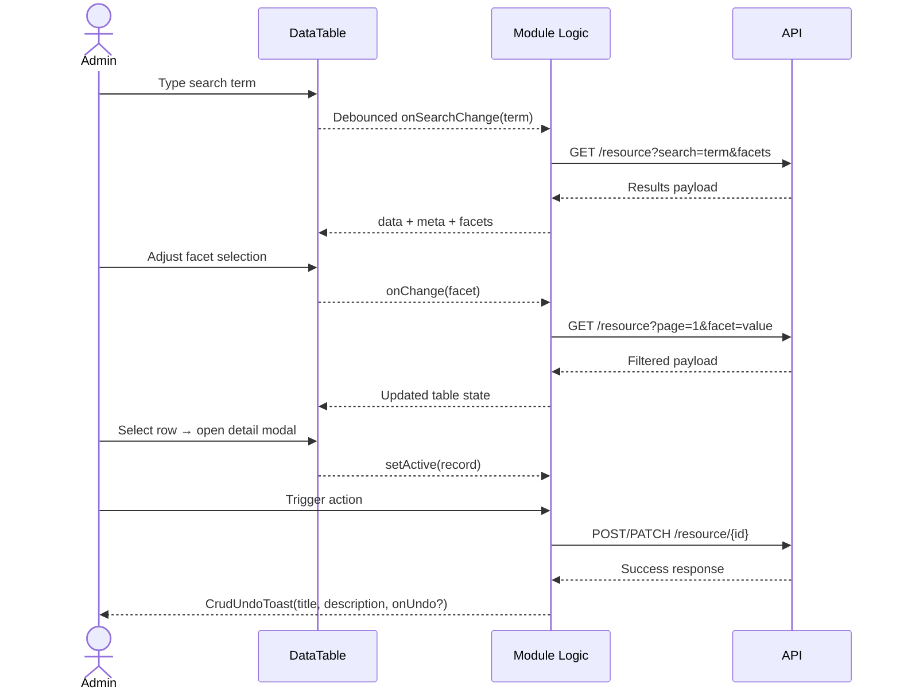
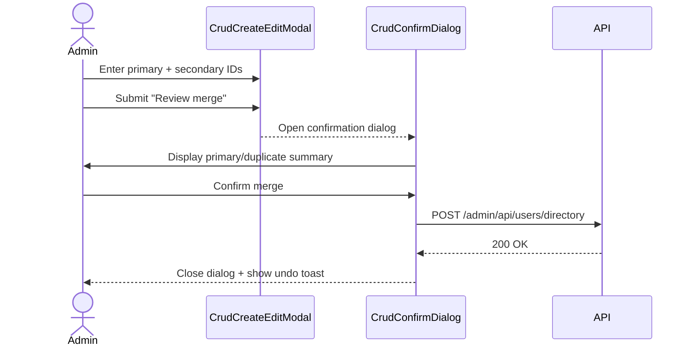
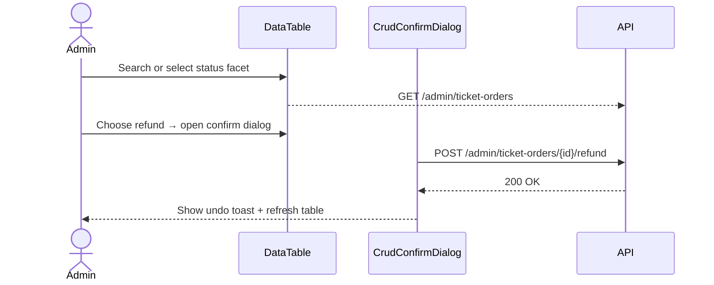
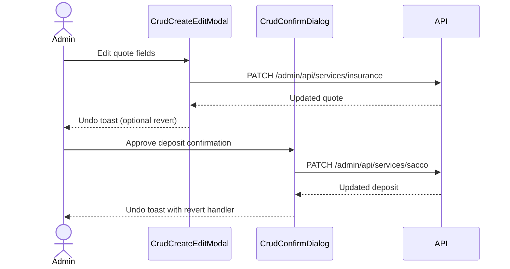

# Admin CRUD Flow Recommendations

This document captures the recommended end-to-end interactions for the new reusable CRUD scaffolds (searchable data tables, create/edit modals, confirmation dialogs, and undo toasts). It is intended to be used by feature owners and QA when validating administrative modules that rely on the shared building blocks introduced in this iteration.

## Standard Journey: Search → Filter → Detail → Action

All admin tables should support a consistent journey: start with a keyword search, refine with facets, inspect record details, and finally execute a mutating action. The sequence diagram below illustrates how the shared `DataTable`, CRUD dialogs, and undo toasts coordinate across layers.

## Module-Specific Flows

### Users Directory (Merge Accounts)

**QA checklist**

- Verify search is debounced (no more than one network request per 300 ms when typing).
- Attempt merge with missing IDs → modal should show validation toast and stay open.
- Confirm merge success produces undo toast; closing modal resets form fields.
- Dismissing confirmation dialog should not invoke the API.

### Ticket Orders (Refund Request)

**QA checklist**

- Validate status facets disable while loading and reflect the active value.
- Confirm error state surfaces friendly messaging when API fails.
- Refund button should be disabled for non-paid orders and while a refund is in-flight.
- Undo toast appears after success and triggers a refresh when clicked.

### Services Dashboard (Insurance + Deposits)

**QA checklist**

- Editing a quote should persist changes and surface a toast with undo copy.
- Issuing a policy should refresh the list and expose a revert action in the toast.
- Deposit buttons must respect current status (disabled when already applied).
- Confirmation dialog spinner blocks double-submits while the API call is pending.

## Additional Notes

- Undo handlers are best-effort. Where full reversal is not available server-side, the toast still communicates success to align user expectations.
- Each module reuses the shared scaffolds—any regression fixes should happen inside the reusable components before applying local overrides.
