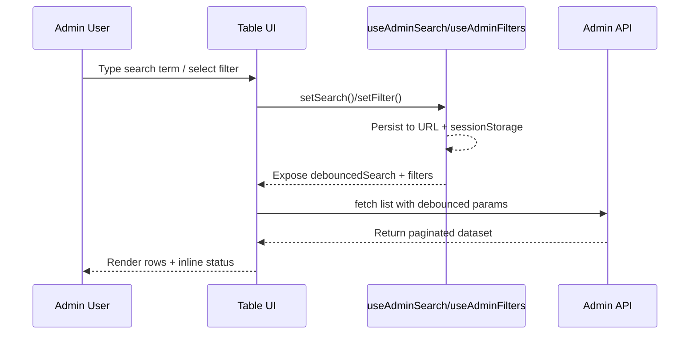
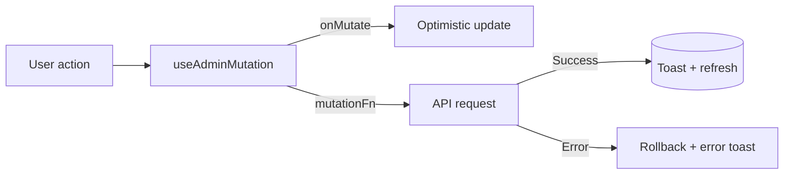
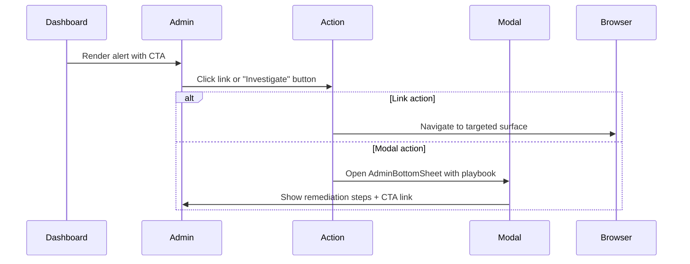

# Admin UI Canonical Flows

This document captures the shared flows that drive the revamped admin surface. Each section includes a high-level Mermaid diagram and implementation notes referencing the new shared hooks and mutation helpers.

## Search + Filter Lifecycle

**Key points**

- `useAdminSearch` owns the debounced query, persistence, and URL synchronisation. Components pass `searchValue` back into `DataTable` for a controlled input.
- `useAdminFilters` keeps filter state in sync with query params and shares the same persistence contract.
- On every debounced change, tables reset to page 1 and trigger a fresh fetch.

## Standardised Mutation Pattern

**Implementation notes**

- `useAdminMutation` centralises optimistic updates, toast copy, and rollback handling. It exposes `state` so row-level controls can surface inline loading/error states.
- Tables use `state.activeId` to disable buttons or inputs for the entity currently mutating.
- Success handlers trigger lightweight refresh helpers to keep local caches in sync.

## Operational Alert Drill-ins

**Highlights**

- Alerts now describe both the issue and the next best action. Link actions deep-link into the relevant admin screen; modal actions open an `AdminBottomSheet` with investigative guidance and a contextual CTA.
- The `DashboardSnapshot` service annotates each alert with structured action metadata so the client can render consistent controls.
