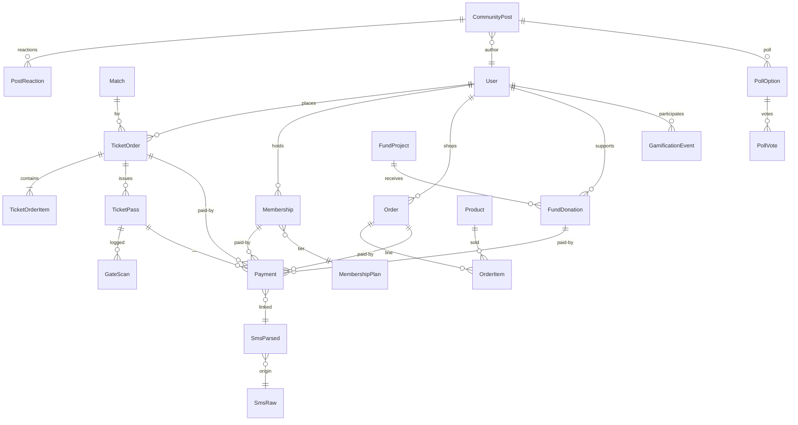
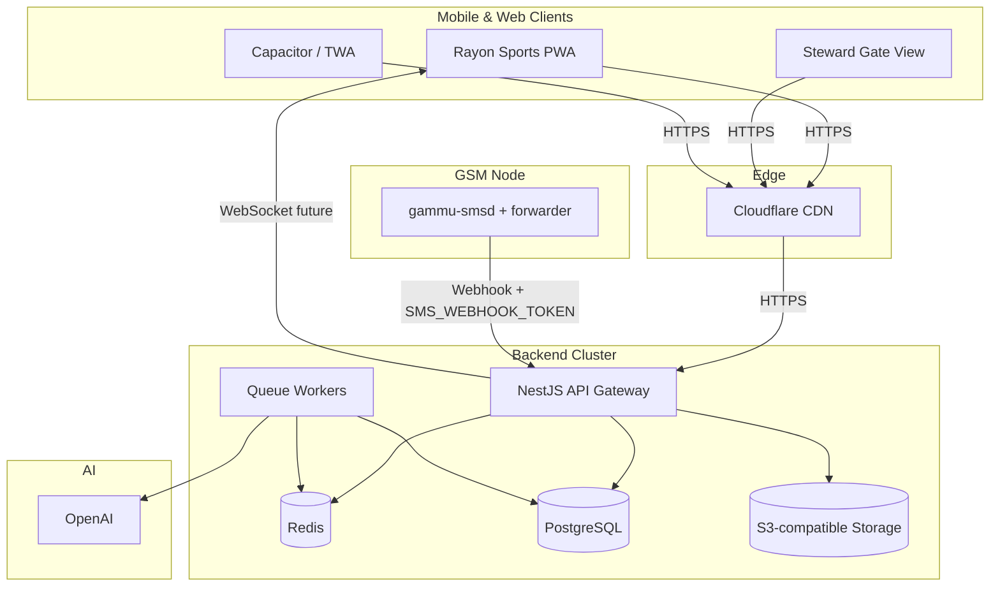

# Phase 0 – Architecture Lockdown

Date: 2025-01-13

## Backend Framework Alignment
- **Framework**: NestJS 11 with Fastify adapter (see `docs/architecture/adr-0001-backend-platform.md`).
- **Runtime**: Node.js 20 (Docker base image to be defined in Phase 1).
- **ORM**: Prisma with PostgreSQL provider.
- **Messaging/Queues**: BullMQ with Redis backend.
- **AI Integration**: OpenAI Responses API for SMS parsing & moderation.

## Data Layer
### Relational Store
- **Primary**: PostgreSQL (Cloud SQL/RDS or Supabase self-managed PG). Decision: operate own Postgres cluster (managed service) with Prisma migrations committed. Supabase client stub retained for future analytics read replicas.
- **Schema Overview**: see ERD below.

### Caching & Queues
- **Redis**: Required for BullMQ job queues (SMS parsing, future real-time feed) and ephemeral caching (tickets, passes).

### Object Storage
- **S3-compatible**: For media assets (shop, community), QR exports, and log archives. Suggested provider: Cloudflare R2.

## GSM Topology
- **Hardware**: Dual LTE modems (Huawei E3372h or Quectel EC25) connected to Ubuntu server/Nuc.
- **Daemon**: `gammu-smsd` with Node forwarder (see `docs/architecture/gsm-modem-runbook.md`).
- **Security**: Locked down VLAN, token-authenticated webhook (`SMS_WEBHOOK_TOKEN`).

## Environment Variables
Key variables consolidated in `docs/architecture/data-model-and-config.md`.

## ERD (Mermaid)

## Infrastructure Diagram (Mermaid)

## Supabase vs Self-hosted PG
- Decision: operate managed Postgres (Cloud SQL/AWS RDS). Supabase client kept only for potential analytics/edge features; not used as primary datastore.

## Deliverables
- This document (architecture lockdown).
- ERD and infra diagrams (above).
- Environment variable contract (linked).
- GSM topology runbook (existing).

Phase 0 complete; ready to proceed to Phase 1.
